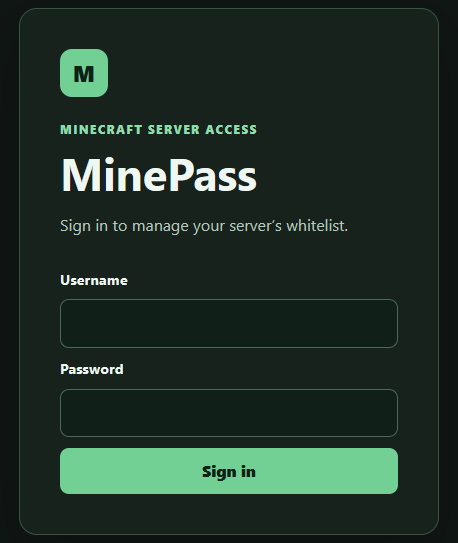
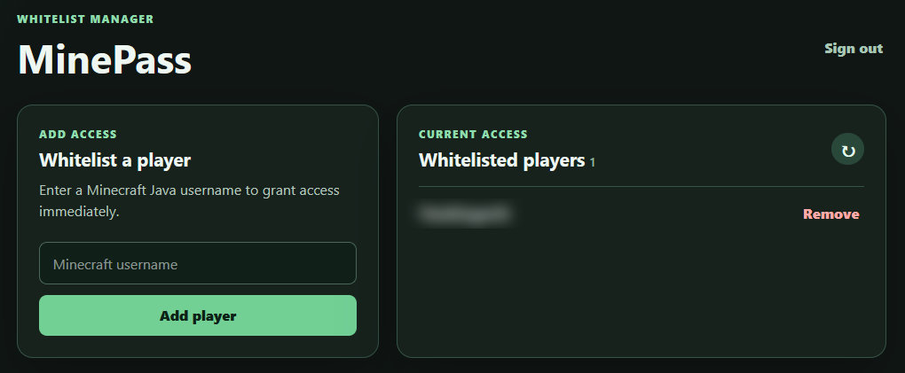

# MinePass - Minecraft Whitelister

**MinePass** is a powerful Minecraft whitelisting tool that allows you to manage your server's whitelist remotely over the internet. With MinePass, you can easily control access to your Minecraft server, add or remove players from the whitelist, and ensure a safe and secure gaming experience for your community.

## Features

- Easy-to-use web interface for managing your server's whitelist.
- Secure authentication to protect your server from unauthorized access.
- Real-time updates to the Minecraft whitelist without the need for server restarts.
- Compatibility with popular Minecraft server software.
- User-friendly design for both server administrators and players.


## Getting Started

### Building MinePass Locally with Docker Compose

Clone the repository and enter its directory:

```shell
git clone https://github.com/quack79/minepass.git
cd minepass
```

Create a `compose.yaml` file with the following contents:

```yaml
services:
  minepass:
    build: .
    container_name: minepass
    environment:
      MP_HOST: YOUR_SERVER_IP:YOUR_RCON_PORT
      MP_PASSWORD: YOUR_SERVER_RCON_PASSWORD
      MP_UI_USERNAME: YOUR_UI_USERNAME # Optional; defaults to "admin"
      MP_UI_PASSWORD: YOUR_UI_PASSWORD
      MP_TITLE: YOUR_TITLE # Optional; defaults to "MinePass"
    ports:
      - "${MP_HOST_PORT:-8080}:8080"
```

   `MP_HOST` must include the RCON port (for example, `192.168.0.2:25575`). 
   Set `MP_HOST_PORT` if port 8080 is already in use (for example, `9090`).

Build and start MinePass:

```shell
docker compose up -d --build
```


## Usage
There are 2 ways you can communicate with this.

### Via the Web UI
Once the Docker image is up and running, head over to `http://localhost:8080`, enter your username and password.



Then you can add or remove players from the dashboard.




### Via the Web API
There are currently 2 endpoints available. You can find them below.

Each endpoint requires the following headers as these are used to validate the request is coming from a trusted source. `MP_UI_USERNAME` defaults to `admin` when it is not configured.
```json
{
    "X-Api-Username": "YOUR_UI_USERNAME",
    "X-Api-Key": "YOUR_UI_PASSWORD"
}
```

| **URL**              | **Method** | **Body**                    |
|----------------------|------------|-----------------------------|
| api/whitelist        | GET        | —                           |
| api/whitelist/add    | POST       | { "username": "string" }    |
| api/whitelist/remove | POST       | { "username": "string" }    |


## Credits

MinePass is made possible thanks to the contributions and support from the following individuals and projects:

- [gin-gonic/gin](https://github.com/gin-gonic/gin): Gin is a web framework written in Go.
- [gorcon/rcon](https://github.com/gorcon/rcon): Source RCON Protocol implementation in Go.

## License

This project is licensed under the MIT License - see the [LICENSE](LICENSE) file for details.

## Feedback and Support

If you encounter any issues (with this fork) or have suggestions for improving MinePass, please [open an issue](https://github.com/quack79/minepass/issues).

We hope you find MinePass to be a valuable tool for managing your Minecraft server's whitelist. Happy gaming!
